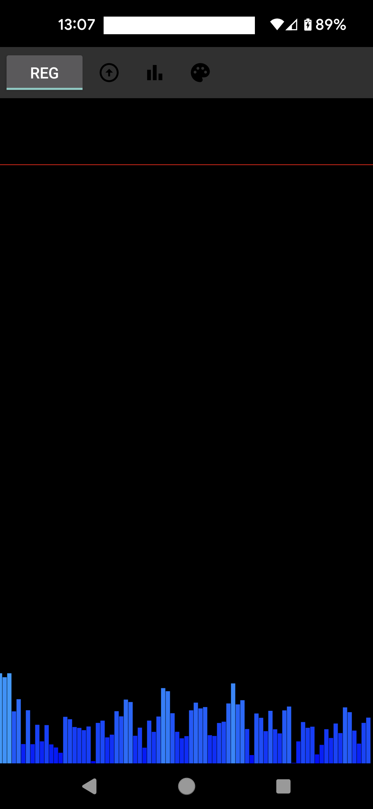
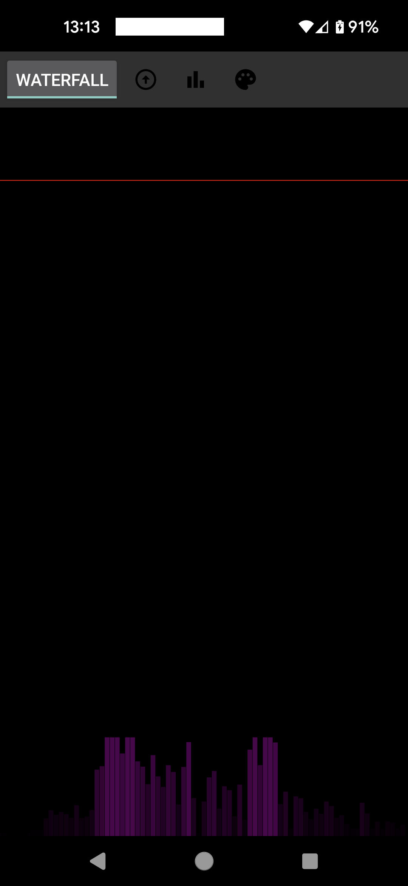
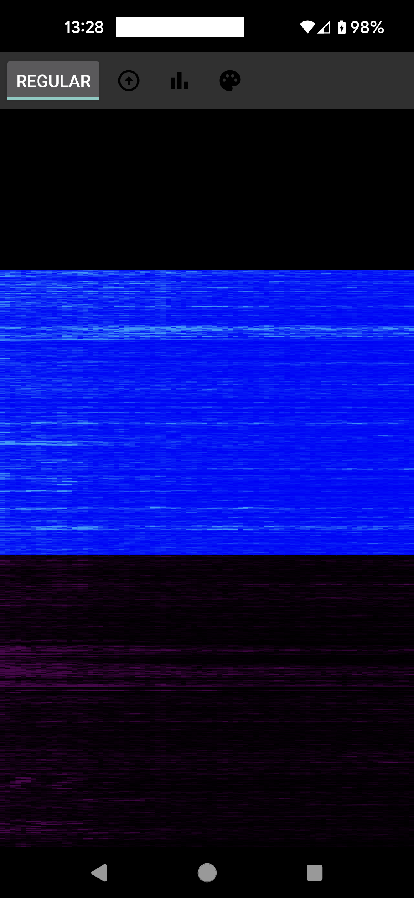
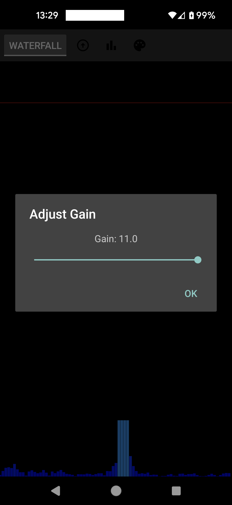

# AudioSpectrograph

A real-time audio spectrum analyzer for Android that provides both traditional FFT and waterfall display modes. This application visualizes audio input from your device's microphone as a frequency spectrum, useful for audio analysis, music visualization, and educational purposes.

## Features

- Real-time audio spectrum analysis
- Two visualization modes:
  - Traditional FFT bar graph display
  - Waterfall spectrogram display
- Adjustable frequency range selection
- Multiple color schemes:
  - Blue to Red (classic spectrum)
  - Black to Purple to Red
- Smooth, efficient rendering optimized for Android
- Configurable display parameters

## Screenshots

<p float="left">
  <a href="docs/screenshots/screen1.png">
    
  </a>
  <a href="docs/screenshots/screen2.png">
    
  </a>
  <a href="docs/screenshots/screen3.png">
    
  </a>
  <a href="docs/screenshots/screen4.png">
    
  </a>
</p>

## Requirements

- Android Studio Arctic Fox or newer
- Android SDK 21 or higher (Android 5.0+)
- Device with microphone support
- Android device with RECORD_AUDIO permission

## Installation

1. Clone this repository:
```bash
git clone https://github.com/ctracy/AudioSpectrograph.git
```

2. Open the project in Android Studio
3. Sync project with Gradle files
4. Build and run on your Android device

## Usage

1. Launch the app
2. Grant microphone permissions when prompted
3. The app will begin displaying the audio spectrum immediately
4. Use the interface buttons to:
   - Toggle between FFT and Waterfall modes
   - Adjust the frequency range
   - Change color schemes

## Controls

- **Toggle Button**: Switch between FFT and Waterfall display modes
- **Frequency Range**: Adjust the visible frequency spectrum
- **Color Scheme**: Toggle between different visualization color patterns

## Technical Details

- Uses Android's AudioRecord API for audio capture
- Implements Fast Fourier Transform (FFT) for frequency analysis
- Custom View implementation for efficient rendering
- Supports both regular and waterfall spectrograms
- Thread-safe audio processing and visualization

## Permissions

The app requires the following permission:
```xml
<uses-permission android:name="android.permission.RECORD_AUDIO" />
```

## Building from Source

1. Open the project in Android Studio
2. Ensure all dependencies are properly synced
3. Build the project (Build → Make Project)
4. Run on an Android device or emulator

## Contributing

Contributions are welcome! Please feel free to submit a Pull Request.

## License

[Add your chosen license here]

## Acknowledgments

- FFT implementation based on [reference your sources if any]
- Inspired by traditional audio analysis tools
- Built with Android Studio and Kotlin/Java

## Contact

[Your contact information or how to reach you for questions]

## Known Issues

- [List any known issues or limitations]

## Future Enhancements

- Additional color schemes
- Save/export capabilities
- More visualization modes
- Frequency labeling
- Audio file input support

---

**Note**: This application is designed for educational and analytical purposes. The accuracy of the frequency analysis depends on the quality of the device's microphone and sampling capabilities.
